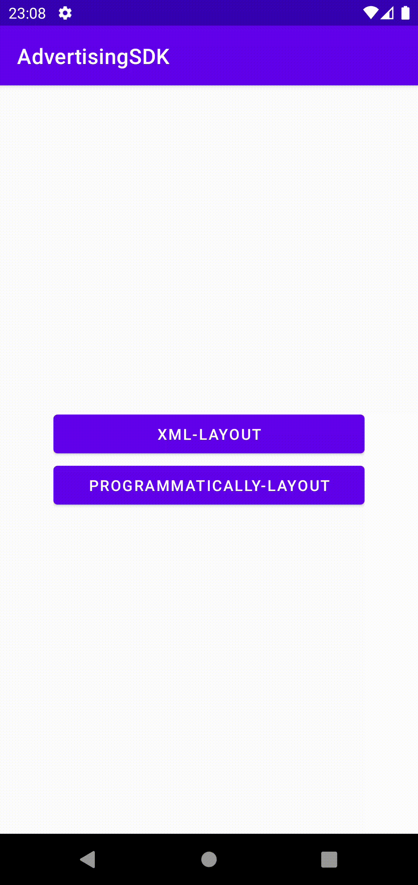

# Advertising Demo app



## Run application

+ Open the advertising-demo-app in the AndroidStudio.

+ Initialize the Tracking SDK.

    + Open [TechApp.kt](app/src/main/kotlin/tech/solutionarchitects/testapplication/TechApp.kt) file.

    + Set up the following arguments in the `TechAdvertising.init()` call, shown in the code below:

    ```kotlin
    class TechApp : Application() {
    
        override fun onCreate() {
            super.onCreate()
    
            TechAdvertising.init(
                context = applicationContext,
                storeUrl = "https://play.google.com/store/apps/details?id=com.myapp",
                publisherId = 123,
                uid = "bfd0620a5017d1362431aea6c1d6e504",
                baseUrl = "https://my.server.com",
                trackingBaseUrl = "https://track.server.com",
                debugMode = true,
                headers = mapOf("Authorization" to {
                    "Bearer Test"
                })
            )
        }
    }
    ```

+ Run the app. Then open `Run` tab in the AndroidStudio.